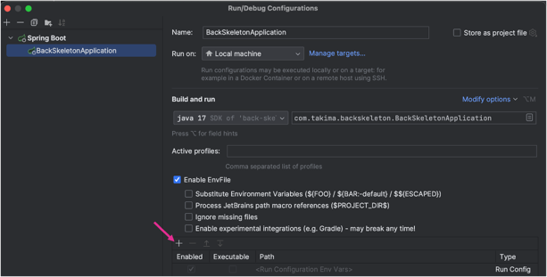

# Your backend API

## Set up 
1. Copie-colle le .env.sample en .env
2. Remplis les variables d'environnement
3. Fait un `docker-compose up`

Et voilà, ton API est prête à être utilisée 

## Pour lancer le projet, tu peux aussi utiliser la configuration de lancement de l'IDE
1. Copie-colle le .env.sample en .env
2. Remplis les variables d'environnement
3. Dans le fichier `docker-compose.yml`, Lance uniquement le service `Lig-database`
4. Lance le projet avec la configuration de l'IDE :

   1. Rajoute le pluggin : https://plugins.jetbrains.com/plugin/7861-envfile
   2. 
   3. 
   4. 
    